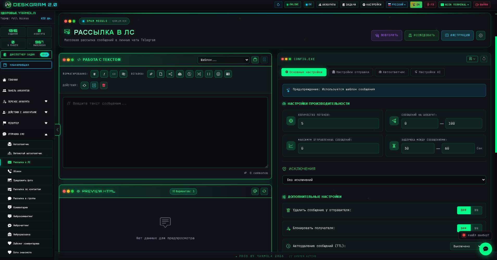
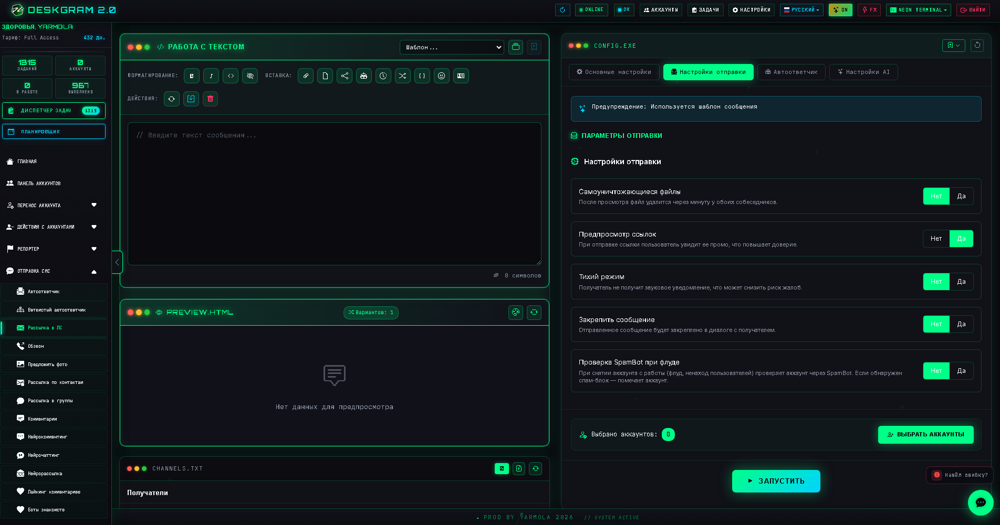
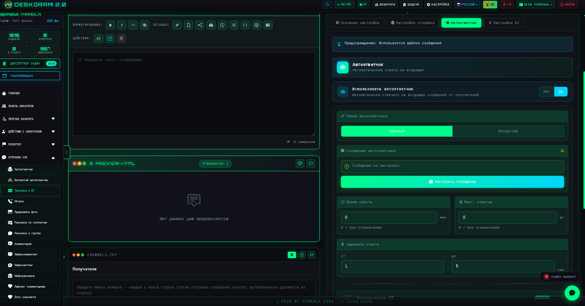
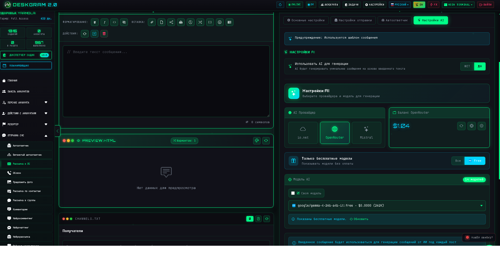

# Рассылка в ЛС Telegram через Deskgram 2

`Рассылка в ЛС` — это модуль Deskgram 2 для массовой отправки сообщений в личные чаты Telegram. Он объединяет многопоточность, лимиты, задержки, автоответчик, AI-генерацию текста и понятный контроль за ходом кампании.

[Главный хаб Deskgram 2](https://github.com/Deskgram-2/deskgram-2-telegram-automation) · [Сайт](https://deskgram2.com/) · [Telegram-бот](https://t.me/DG2welcomebot) · [Web preview](https://deskgram2.com/web-preview?path=%2Fapp-demo%2F&lang=ru)
## Интерактивный Web Preview

Попробовать модуль в браузере: [Открыть веб-превью](https://deskgram2.com/web-preview?path=%2Fapp-demo%2Ffunctions%2Fspam_pm&lang=ru)

Если хотите сначала понять, подходит ли вам этот сценарий, откройте веб-превью: так проще оценить интерфейс, сравнить модуль с соседними разделами и только потом переходить к установке и настройке.

## Кратко о модуле

| Параметр | Что внутри |
|---|---|
| Основная задача | Массовая отправка сообщений в личные чаты Telegram |
| Поддержка контента | Текст, медиа, репосты, истории и другие форматы конструктора |
| Дополнительно | Автоответчик, расписание, AI-рерайт и генерация |
| Полезен для | Лидогенерации, прогрева, follow-up коммуникаций |
| Связанные модули | Сбор аудитории, Управление прокси, Нейрочаттинг |

## Что умеет модуль

- отправлять сообщения в личные чаты Telegram;
- работать по списку получателей;
- настраивать потоки, лимиты и задержки;
- использовать AI для генерации и рерайта сообщений;
- подключать автоответчик после рассылки;
- сохранять статистику и логи выполнения;
- управлять исключениями и черными списками.

## Быстрый старт

1. Подготовьте список получателей.
2. Соберите сообщение в конструкторе.
3. Настройте потоки, лимиты и задержки.
4. При необходимости включите AI и автоответчик.
5. Выберите аккаунты и запустите задачу.

## Что стоит связать с модулем

- [Сбор аудитории](https://github.com/Deskgram-2/telegram-audience-parser-deskgram), если база получателей еще не подготовлена.
- [Панель аккаунтов](https://github.com/Deskgram-2/telegram-account-manager-deskgram), если сначала нужно собрать рабочую сетку аккаунтов.
- [Управление прокси](https://github.com/Deskgram-2/telegram-proxy-manager-deskgram), если сценарий зависит от стабильной инфраструктуры.
- [Настройки автоматизации](https://github.com/Deskgram-2/telegram-automation-settings-deskgram), если используется AI и общие параметры программы.
- [Массовые подписки](https://github.com/Deskgram-2/telegram-join-groups-deskgram), если перед рассылкой нужно подготовить присутствие аккаунтов в среде.

## Какие цепочки здесь особенно сильны

- [Нейрорассылка](https://github.com/Deskgram-2/telegram-neuro-mailing-deskgram), если после обычного outreach нужен более разговорный AI-сценарий;
- [Автоответчик](https://github.com/Deskgram-2/telegram-autoresponder-deskgram), если входящие ответы должны обрабатываться как отдельный слой;
- [Инвайт](https://github.com/Deskgram-2/telegram-invite-tool-deskgram), если direct messaging работает в общей growth-цепочке;
- [Сбор аудитории из комментариев](https://github.com/Deskgram-2/telegram-comment-audience-parser-deskgram), если нужен более теплый источник базы;
- [Сбор писавших в чатах](https://github.com/Deskgram-2/telegram-active-chat-users-parser-deskgram), если вы строите коммуникацию от живых обсуждений;
- [Диспетчер задач](https://github.com/Deskgram-2/telegram-task-manager-deskgram), если важно централизованно следить за рассылкой и follow-up этапами.

## Интерфейс модуля

### Главный экран

На основном экране находятся конструктор сообщения, список получателей и запуск задачи.

### Параметры отправки

Здесь настраиваются дополнительные режимы доставки и поведения сообщений.

### Автоответчик

Если после первой отправки нужен диалог, можно подключить автоответчик и сбор входящих ответов.

### AI-настройки

AI помогает делать сообщения менее однообразными и лучше адаптировать их под сценарий.

## Когда особенно полезен

- когда нужно запустить поточную личную рассылку по собранной базе;
- когда после первого сообщения важен follow-up или автоответ;
- когда текст нужно варьировать, а не отправлять одну и ту же заготовку;
- когда нужен контроль по потокам, логам и статусам в одном интерфейсе.

## Почему это удобнее ручной рассылки

| Ручной подход | Рассылка в ЛС через Deskgram 2 |
|---|---|
| Сообщения уходят медленно | Есть многопоточность |
| Лимиты тяжело контролировать | Лимиты и задержки задаются заранее |
| Нет общей статистики | Ведутся логи и статус выполнения |
| Диалоги после первой отправки теряются | Можно включить автоответчик |
| Текст быстро становится шаблонным | AI помогает уникализировать сообщения |

## Сценарии применения

### Сценарий 1. Холодный outreach по уже собранной базе

Это базовый use-case: сначала вы получаете аудиторию через [сбор аудитории](https://github.com/Deskgram-2/telegram-audience-parser-deskgram) или другие парсеры, затем запускаете личные сообщения по сегментированной базе.

### Сценарий 2. Follow-up после вовлечения

Если пользователь уже видел комментарии, взаимодействовал в чате или попал в теплую базу, direct messaging становится следующим шагом после engagement-модулей. Здесь особенно полезны AI и автоответчик.

### Сценарий 3. Коммуникация как часть growth-цепочки

В более широкой воронке модуль часто используется не изолированно, а в цепочке `discovery -> parser -> DM -> invite` или `comments -> DM -> autoresponder`. За счет этого личка становится не первым, а логичным следующим касанием.

## Что выбрать: рассылку в ЛС или инвайт

| Если задача такая | Лучше использовать |
|---|---|
| Нужен личный контакт и сообщение до вступления в сообщество | [Рассылка в ЛС](https://github.com/Deskgram-2/telegram-direct-messaging-deskgram) |
| Нужно сразу наращивать группу или канал по готовой базе | [Инвайт](https://github.com/Deskgram-2/telegram-invite-tool-deskgram) |
| Нужна двухшаговая воронка | Сначала ЛС, потом инвайт |
| Нужен диалог после первого касания | ЛС + [автоответчик](https://github.com/Deskgram-2/telegram-autoresponder-deskgram) |

## Что выбрать: обычную рассылку в ЛС или нейрорассылку

| Если задача такая | Лучше использовать |
|---|---|
| Нужен контролируемый массовый outreach с понятной структурой и шаблонами | [Рассылка в ЛС](https://github.com/Deskgram-2/telegram-direct-messaging-deskgram) |
| Нужен более разговорный AI-сценарий в личке | [Нейрорассылка](https://github.com/Deskgram-2/telegram-neuro-mailing-deskgram) |
| Нужно сначала масштабно коснуться базы, а потом углублять диалог | Сначала обычная рассылка, потом нейрорассылка |
| Важна гибридная воронка с ручным контролем и AI-слоем | Оба модуля в одной цепочке |

## FAQ для рабочих сценариев

### Когда лучше брать базу из обычного парсинга, а когда из комментариев?

Обычный [сбор аудитории](https://github.com/Deskgram-2/telegram-audience-parser-deskgram) подходит для широкой базы из чатов и групп. [Сбор из комментариев](https://github.com/Deskgram-2/telegram-comment-audience-parser-deskgram) лучше использовать, когда нужен более теплый сегмент пользователей, уже вовлеченных в обсуждения.

### Когда имеет смысл подключать AI, а когда хватит обычного текста?

Если у вас повторяющийся оффер и важна масштабируемость, шаблонный или вручную собранный текст часто достаточно хорош. AI полезнее там, где нужно больше вариативности, мягкости формулировок и адаптации под разные сегменты базы.

### Когда автоответчик обязателен, а когда можно без него?

Если рассылка должна просто доставить первое сообщение, автоответчик не обязателен. Если задача строится вокруг follow-up, обработки входящих и перевода пользователя дальше по воронке, его лучше включать сразу.

## Смежные репозитории

- [Главный хаб Deskgram 2](https://github.com/Deskgram-2/deskgram-2-telegram-automation)
- [Сбор аудитории](https://github.com/Deskgram-2/telegram-audience-parser-deskgram)
- [Управление прокси](https://github.com/Deskgram-2/telegram-proxy-manager-deskgram)
- [Панель аккаунтов](https://github.com/Deskgram-2/telegram-account-manager-deskgram)
- [Настройки автоматизации](https://github.com/Deskgram-2/telegram-automation-settings-deskgram)
- [Нейрорассылка](https://github.com/Deskgram-2/telegram-neuro-mailing-deskgram)
- [Автоответчик](https://github.com/Deskgram-2/telegram-autoresponder-deskgram)
- [Инвайт](https://github.com/Deskgram-2/telegram-invite-tool-deskgram)
- [Диспетчер задач](https://github.com/Deskgram-2/telegram-task-manager-deskgram)

## FAQ


### Можно ли посмотреть интерфейс до установки?

Да. В этом README уже есть прямая ссылка на веб-превью: можно открыть модуль в браузере, посмотреть структуру раздела и понять, подходит ли он под вашу задачу еще до установки и настройки аккаунтов.

### Можно ли использовать свой текст без AI?

Да. AI — это дополнительный слой, а не обязательное условие.

### Можно ли собирать ответы пользователей?

Да. Для этого можно использовать встроенный автоответчик и связанные сценарии обработки ответов.

### Как снижать риск ограничений?

Использовать аккуратные потоки, лимиты, задержки и не перегружать новые аккаунты.

### Подходит ли модуль для follow-up сценариев?

Да. Это один из самых естественных кейсов для связки с автоответчиком.

## Полезные ссылки

- [Главный хаб Deskgram 2](https://github.com/Deskgram-2/deskgram-2-telegram-automation)
- [Сайт Deskgram 2](https://deskgram2.com/)
- [Telegram-бот Deskgram 2](https://t.me/DG2welcomebot)
- [Web preview](https://deskgram2.com/web-preview?path=%2Fapp-demo%2F&lang=ru)

